# 📱 CrazyPhone

A held-item smartphone: contacts, group texting, photos/albums, an optional mayor election, and an
optional Simple Voice Chat integration (calls + voice messages). Built with [Stonecutter](https://stonecutter.kikugie.dev/)
on a single shared source tree targeting both **NeoForge** and **Fabric**, across several Minecraft
versions.

[](https://www.minecraft.net/)
[](https://neoforged.net/)
[](https://fabricmc.net/)
[](https://adoptium.net/)
[](#-license)

> [!NOTE]
> CrazyPhone is a standalone, hand-written rewrite of the smartphone feature originally found in my own
> **crazythings** mod. It keeps the same look and core features, but the codebase was re-architected -
> most importantly to fix a server-crashing data growth bug, see [Why this exists](#-why-this-exists).

---

## 📖 Table of Contents

- [Features](#-features)
- [Platforms & versions](#-platforms--versions)
- [Requirements](#-requirements)
- [Installation](#-installation-players--server-admins)
- [Building from source](#-building-from-source)
- [Configuration](#-configuration)
- [Commands](#-commands)
- [Screenshots](#-screenshots)
- [Localization](#-localization)
- [Why this exists](#-why-this-exists)
- [Project structure](#-project-structure)
- [Credits & License](#-credits)

---

## ✨ Features

**Phone basics** - two-step registration (number/name, then a dedicated password step with a clear warning
that the password is visible to server admins) + PIN sign-in, home screen launcher, lock screen, back/home
navigation.

**Messaging** - contacts, favorites, and groups in one scrollable, recency-sorted screen; group
conversations with their own settings (rename, custom icon, invite/exclude, admin); real-time text;
sending photos from your album; read-notification badges; hover tooltips for timestamps/senders. Pixel-art
emoji throughout chat, via a bundled [Pixel Twemoji 9x](https://modrinth.com/resourcepack/pixel-twemoji-9x)
font - paste a real Unicode emoji directly, or type a `:shortcode:` (English or, for a curated common set,
your own language - see [Localization](#-localization)) or a classic ASCII emoticon (`:)`, `<3`, `xD`, ...);
typing converts live the moment you hit space, no separate resource pack install needed.

**Camera** - a native, dependency-free photo feature on both loaders, with three ways into the same
full-screen capture overlay (mouse wheel to zoom, right-click to shoot, left-click/Escape to cancel; the
mouse stays grabbed the whole time, so you can still look around while framing a shot): the camera icon
inside a conversation (sends the shot into that conversation), the home screen's Photo icon, or simply
punching while holding the phone - the latter two save straight to the phone's own photo list instead of a
conversation. **My Photos**, reachable from the home screen, is a flat, scrollable grid of every photo a
phone owns (no album/folder layer) with delete, save-to-inventory, and send-to-conversation actions. The
server keeps a small thumbnail (shown by default in chat, as the saved photo item's icon, and in My Photos)
and a larger full-size version (resolution and upload size cap both configurable, see
[Configuration](#-configuration)), fetched on demand when a photo is opened full-size. Saving a photo to your
inventory gives you a physical item that re-opens the same viewer on right-click, always the same visual
width regardless of the photo's actual resolution (height adapts). A locked or not-yet-registered phone
can't take a photo through any of the three entry points. See the [platform table](#-platforms--versions)
for which targets have this working today.

**Sneak-presenting** - sneak while holding a photo item to hold it up in front of you, both hands gripping
it, visible to yourself (first-person, rendered in-world with real lighting rather than a flat GUI overlay)
and to everyone else (third-person). Held-photo size is always the same visual width regardless of the
photo's resolution, matching the item's normal rendering.

**Selfie mode** - hold the phone and press F5 to enter a dedicated selfie view: the phone extends on a
selfie stick, held out and angled with the mouse (drag to reframe, starting from whatever direction you
were already looking), while your arm and head visibly pose and track the shot in-world - both for yourself
and for anyone else looking at you. The HUD (hotbar, crosshair, etc.) hides automatically during capture,
and the item model swaps correctly between your own view and what other players see. Full parity between
NeoForge and Fabric on both actively maintained targets - see the
[maintenance table](#-platforms--versions) below.

**Voice calls & voice messages** *(NeoForge only, optional, requires [Simple Voice Chat](https://modrepo.de/minecraft/voicechat))*
- 1:1 and group voice calls: ring notification, dedicated Incoming Call / Calling / In Call screens,
  auto-hangup on dropping the phone or moving it to another inventory (not on cursor-carry), auto-kick
  when left alone in a call, a "call in progress" / call summary entry posted to the conversation itself.
- Voice messages: record and send a clip, played back with a live waveform, play/pause, and a speed
  toggle (0.5x/1x/2x); audio is only ever fetched from the server when a recipient clicks play.
- Fully optional both ways: the mod loads and works normally with Simple Voice Chat absent, and every
  piece of it can be turned off independently - see [Configuration](#-configuration).

**Soulbound enchantment** *(≥1.20.5 only)* - an Ancient City-only enchantment that keeps enchanted items
out of your death drops and hands them back on respawn.

**Mayor election** *(optional)* - candidate list with campaign posters, in-app voting with a cooldown,
commands to manage candidates and toggle the feature.

**Per-feature toggles** - calls, voice messages, sending images, and the mayor election can each be turned
on/off globally (config or command) and/or restricted to specific
players/groups via a permission node, if a permission plugin is installed - see [Commands](#-commands).
Runtime-configurable on NeoForge; compiled-in defaults on Fabric for now.

**Localization** - every button, tooltip, and label goes through the lang files (English + French
shipped); no hardcoded UI strings.

**Built to scale** - conversation history and voice/image payloads are capped and never broadcast
wholesale; see [Why this exists](#-why-this-exists).

---

## 🧩 Platforms & versions

One shared `src/main/java` tree, preprocessed per target by [Stonecutter](https://stonecutter.kikugie.dev/)
(`//? if fabric` / `//? if neoforge`, plus per-version checks) into 9 build targets.

### Maintenance status

Update this table whenever a target's status actually changes - it's the quick answer to "is this version
still getting updates", separate from the detailed per-feature table below.

| Target | Status |
|---|---|
| Fabric 1.20.1 | ⚪ Not functional - phone networking needs an API absent before 1.20.5, no active work planned |
| NeoForge 1.20.4 | ⚪ Frozen - unmaintained indefinitely (since 2026-09-02), local builds only |
| NeoForge 1.21.1 | 🟢 Actively maintained - primary NeoForge target |
| Fabric 1.21.1 | 🟢 Actively maintained - primary Fabric target |
| NeoForge 1.21.10 | ⚪ Frozen - unmaintained indefinitely (since 2026-09-03) |
| NeoForge 26.1 | 🟢 Actively maintained |
| Fabric 26.1 | 🟢 Actively maintained |
| NeoForge 26.2 | 🟡 Work in progress - doesn't compile yet, see [PORTING-26x.md](PORTING-26x.md) |
| Fabric 26.2 | 🟡 Work in progress - doesn't compile yet, see [PORTING-26x.md](PORTING-26x.md) |

Only the 🟢 targets get new features and bugfixes going forward. The 26.x line is otherwise a newer,
ongoing port - see [PORTING-26x.md](PORTING-26x.md) for its detailed status and remaining work.

| | Fabric 1.20.1 | NeoForge 1.20.4 *(unmaintained)* | NeoForge 1.21.1 | Fabric 1.21.1 | NeoForge 1.21.10 *(unmaintained)* | NeoForge 26.1 | Fabric 26.1 | NeoForge 26.2 | Fabric 26.2 |
|---|:---:|:---:|:---:|:---:|:---:|:---:|:---:|:---:|:---:|
| Phone, messaging, contacts, groups | — | ✅ | ✅ | ✅ | ✅ | ✅ | ✅ | — *(pending)* | — *(pending)* |
| Mayor election | — | ✅ | ✅ | ✅ | ✅ | ✅ | ✅ | — *(pending)* | — *(pending)* |
| Native camera (capture/viewer/photo item/My Photos) | — | ✅ | ✅ | ✅ | — *(pending)* | ✅ | ✅ | — *(pending)* | — *(pending)* |
| Sneak-presenting (hold a photo up, two-hand grip) | — | ✅ | ✅ | ✅ | — *(pending)* | ✅ | ✅ | — *(pending)* | — *(pending)* |
| Selfie mode (camera/arm/head on a selfie stick) | — | — | ✅ | ✅ | — | ✅ | ✅ | — *(pending)* | — *(pending)* |
| Voice calls & voice messages | — | ✅ *(SVC)* | ✅ *(SVC)* | — | ✅ *(SVC)* | ✅ *(SVC)* | — | — *(pending)* | — |
| Soulbound enchantment | — | — | ✅ | ✅ | ✅ | ✅ | ✅ | — *(pending)* | — *(pending)* |
| Runtime-configurable settings | — | ✅ | ✅ | — | ✅ | ✅ | — | — *(pending)* | — |

- **NeoForge 1.21.10**'s camera and sneak-presenting features compile but don't work yet: Mojang reworked
  both item rendering and the screenshot/texture APIs the native pipeline uses on that version, and porting
  to the new APIs is a separate, tracked follow-up.
- **NeoForge 26.1** compiles clean and has been live-tested (native camera, sneak-presenting including
  two-hand dual-photo, selfie mode, voice calls) - the newest fully-verified target in the project.
- **NeoForge 26.2** doesn't compile yet - blocked on the same item-rendering API migration 26.1 needed,
  not yet finished for this node. See [PORTING-26x.md](PORTING-26x.md).
- **Fabric 1.20.1** is a walking skeleton for now - the item exists and registers, but the phone's
  networking layer needs an API (`CustomPacketPayload`) that doesn't exist before 1.20.5, so none of the
  screens/messaging/camera work yet on that specific version.
- **Fabric 1.21.1** has the core feature set, the native camera pipeline (including punch-to-shoot,
  standalone capture, and My Photos), sneak-presenting, selfie mode, and the Soulbound enchantment - but no
  voice calls/messages, since [Simple Voice Chat](https://modrepo.de/minecraft/voicechat) integration hasn't
  been ported to Fabric yet.
- **Fabric 26.1** compiles clean and is live-tested, with full parity with NeoForge 26.1 except voice
  calls/messages (same Fabric SVC gap as 1.21.1).
- **Fabric 26.2** doesn't compile yet - blocked on the same item-rendering API migration 26.1/26.2 needed,
  plus its own Fabric-specific registration gap (no `BuiltinItemRendererRegistry`-equivalent wired up for
  the new API yet). See [PORTING-26x.md](PORTING-26x.md).

---

## 📋 Requirements

**NeoForge** (1.21.1 or 1.21.10 - 1.20.4 still builds locally but is no longer published or maintained):

| Dependency | Required for |
|---|---|
| [NeoForge](https://neoforged.net/), matching your Minecraft version | Runtime |
| [Simple Voice Chat](https://modrepo.de/minecraft/voicechat), matching version | Runtime only, **optional** - calls/voice messages are simply unavailable without it |

**Fabric** (1.20.1 or 1.21.1):

| Dependency | Required for |
|---|---|
| [Fabric Loader](https://fabricmc.net/) `0.16.9+`, matching your Minecraft version | Runtime |
| [Fabric API](https://modrinth.com/mod/fabric-api), matching version | Runtime |

No Simple Voice Chat on Fabric yet - see the [platform table](#-platforms--versions) for what that means
feature-wise.

---

## 🎮 Installation (players / server admins)

**NeoForge:**
1. Install [NeoForge](https://neoforged.net/) for your target Minecraft version (1.21.1 or 1.21.10 - see the [platform table](#-platforms--versions) for why 1.20.4 isn't listed here anymore).
2. (Optional) Install **[Simple Voice Chat](https://modrepo.de/minecraft/voicechat)** into `mods/` for calls and voice messages.
3. Drop the built `crazyphone-*.jar` for that version into `mods/`.
4. Launch the game, craft/obtain a Crazy Phone, and register a number.

**Fabric:**
1. Install [Fabric Loader](https://fabricmc.net/) and [Fabric API](https://modrinth.com/mod/fabric-api) for your target Minecraft version (1.20.1 or 1.21.1).
2. Drop the built `crazyphone-*.jar` for that version into `mods/`.
3. Launch the game, craft/obtain a Crazy Phone, and register a number - see the [platform table](#-platforms--versions) for what's available on Fabric today.

---

## 🔨 Building from source

```bash
git clone https://github.com/<your-username>/CrazyPhone.git
cd CrazyPhone
```

This is a [Stonecutter](https://stonecutter.kikugie.dev/) multi-version project: every version listed in
[Platforms & versions](#-platforms--versions) is its own Gradle subproject under `versions/`, prefix every
task with its target:

```bash
# Windows
gradlew.bat :1.21.1:build
gradlew.bat :1.21.1:runClient
gradlew.bat :1.21.1-fabric:build
gradlew.bat :1.21.1-fabric:runClient

# Linux / macOS
./gradlew :1.21.1:build
./gradlew :1.21.1:runClient
./gradlew :1.21.1-fabric:build
./gradlew :1.21.1-fabric:runClient
```

Swap `1.21.1` for `1.20.4` *(unmaintained, local builds only)*, `1.21.10`, `26.1` or `26.2` (NeoForge), or
`1.21.1-fabric` for `1.20.1-fabric`, `26.1-fabric` or `26.2-fabric` (Fabric).

**Testing across several nodes at once** (Windows/PowerShell): `scripts/dev-launch.ps1` wraps the commands
above with PID/log tracking per (version, kind) and a fixed dedicated-server port per node, so you don't
have to hand-manage `server.properties` port collisions or hunt `tasklist` for the right `java.exe`:

```powershell
.\scripts\dev-launch.ps1 list                    # every node, its loader, its assigned server port
.\scripts\dev-launch.ps1 client 26.1              # launch, tracked by PID + log
.\scripts\dev-launch.ps1 server 1.21.1-fabric
.\scripts\dev-launch.ps1 status                  # what's actually running right now
.\scripts\dev-launch.ps1 tail 26.1 client         # live-follow its log
.\scripts\dev-launch.ps1 stop 26.1 client         # or "all" for both client+server
.\scripts\dev-launch.ps1 port 1.20.4              # patch that version's server.properties/eula.txt
```

Run `Get-Help .\scripts\dev-launch.ps1 -Full` for the complete command reference. Set
`$env:CRAZYPHONE_JAVA_HOME` if your JDK 21 install isn't at the script's own default path.

Run the test suite (boots a real, headless game instance so tests can use registries/data components) -
NeoForge only, per version:

```bash
gradlew.bat :1.21.1:test
```

### Publishing a release

Pushing a tag matching `v*` (e.g. `v1.2.1`) triggers
[`.github/workflows/release.yml`](.github/workflows/release.yml), which builds and publishes every node
currently considered ready to ship (see each build script's own `readyToPublish` check) to both
[Modrinth](https://modrinth.com/) and [CurseForge](https://curseforge.com/), via the
[Minotaur](https://github.com/modrinth/minotaur) and
[CurseForgeGradle](https://github.com/Darkhax/CurseForgeGradle) Gradle plugins. It's dormant on every other
push/PR - a plain local build never sets the tokens below, so nothing publish-related ever runs outside
this workflow.

One-time setup, before the first tag actually publishes anything:

1. Create the mod's listing on Modrinth and CurseForge, if not done yet.
2. Set two repository **variables** (`Settings → Secrets and variables → Actions → Variables`):
   `modrinth_project_id` (the Modrinth project's slug or id) and `curseforge_project_id` (the CurseForge
   project's numeric id).
3. Set two repository **secrets** (same page, `Secrets` tab): `MODRINTH_TOKEN` (a Modrinth personal access
   token with "Create versions" scope) and `CURSEFORGE_TOKEN` (a CurseForge API token, from My Profile → API
   Tokens on curseforge.com).

---

## ⚙️ Configuration

**NeoForge:** generated at `config/crazyphone-common.toml` on first run. Every `*FeatureEnabled` value
below can also be changed at runtime with `/crazyphone feature`, without editing the file or restarting -
see [Commands](#-commands).

**Fabric:** the same settings exist as compiled-in defaults (shown below) - not yet exposed as an editable
file or via `/crazyphone feature`.

| Option | Default | Range | Description |
|---|---|---|---|
| `maxStoredMessagesPerConversation` | `300` | 10-10000 | Messages kept on disk per conversation; oldest dropped first once exceeded. |
| `maxMessagesSentPerRequest` | `100` | 10-1000 | Messages sent to a client in one page load of a conversation. |
| `maxImagesStoredPerConversation` | `50` | 5-2000 | Image messages kept on disk per conversation (capped separately - heaviest text-adjacent payload). |
| `maxPhotosStoredPerOwner` | `300` | 10-5000 | Photos (both resolutions) kept on disk per owning phone number; oldest dropped first once exceeded, independent of conversation trimming. |
| `photoFullMaxDimension` | `1024` | 64-4096 | Max size in pixels (longer side) for a photo's full-quality version. Higher looks sharper, costs more storage/network per photo. |
| `photoFullMaxUploadBytes` | `4000000` | 100000-50000000 | Server-side ceiling on a full-quality photo upload; raise alongside `photoFullMaxDimension` if legitimate uploads start getting rejected. |
| `mayorElectionFeatureEnabled` | `true` | - | Global switch for the mayor election feature. |
| `callsFeatureEnabled` | `true` | - | Global switch for voice calls. No effect without Simple Voice Chat installed. (NeoForge only) |
| `voiceMessagesFeatureEnabled` | `true` | - | Global switch for recording/sending voice messages. No effect without Simple Voice Chat installed. (NeoForge only) |
| `imagesFeatureEnabled` | `true` | - | Global switch for sending images into a conversation. |
| `voicechatIntegrationEnabled` | `true` | - | Master switch for the whole Simple Voice Chat integration (both calls and voice messages). (NeoForge only) |
| `callRingTimeoutSeconds` | `30` | 5-120 | How long a call rings before an unanswered callee counts as a missed call. (NeoForge only) |
| `aloneInCallKickSeconds` | `5` | 1-60 | How long a call stays open with one participant left before they're auto-removed. (NeoForge only) |
| `maxVoiceMessagesStoredPerConversation` | `30` | 5-500 | Voice messages (with audio) kept on disk per conversation. (NeoForge only) |
| `maxVoiceMessageRecordingSeconds` | `60` | 5-600 | Maximum length of a single voice message recording. (NeoForge only) |
| `soulboundEnchantmentEnabled` | `true` | - | Whether the Soulbound enchantment actually keeps enchanted items on death. |

**Permissions** *(NeoForge only for now)*: each toggleable feature also has a permission node
(`crazyphone.feature.<calls|voice_messages|images|mayor_voting>`), for restricting a feature to
specific players/groups instead of the whole server. Allowed for everyone by default; only takes effect
if a permission plugin (e.g. LuckPerms) is installed. A feature is usable only when **both** its global
switch is on **and** the player has the permission.

---

## 🖥️ Commands

Everything lives under `/crazyphone`. Arguments with a known set of values (registered phone numbers,
mayor candidates, feature names) tab-complete. *(Command tree is ported to Fabric too, minus the
`mayor candidate program` leaf - not yet ported.)*

| Command | Permission | Description |
|---|:---:|---|
| `/crazyphone give <number>` | 4 | Give yourself the phone registered to `<number>`. |
| `/crazyphone delete <number>` | 4 | Delete the phone registered to `<number>` and scrub it from every contact list. |
| `/crazyphone list [search]` | 4 | Search registered phones by number/name. |
| `/crazyphone feature list` | 2 | Show every toggleable feature's current global state. |
| `/crazyphone feature <name> <true\|false>` | 4 | Enable/disable a feature globally, at runtime. |
| `/crazyphone mayor vote <number>` | *(any player)* | Cast a vote - what the in-phone **Vote** button runs; not meant to be typed by hand. |
| `/crazyphone mayor election <true\|false>` | 4 | Enable/disable the election feature entirely. |
| `/crazyphone mayor voting <true\|false>` | 4 | Open/close voting while keeping the feature visible. |
| `/crazyphone mayor votes show` | 2 | Print current vote tallies. |
| `/crazyphone mayor votes clear <number>` | 4 | Clear a single player's vote (e.g. to let them re-vote). |
| `/crazyphone mayor candidate add <number>` | 4 | Register a phone number as a mayor candidate. |
| `/crazyphone mayor candidate remove <number>` | 4 | Remove a mayor candidate. |
| `/crazyphone mayor candidate program <number>` | 4 | Attach the image currently held in hand as that candidate's campaign poster. *(NeoForge only)* |

Permission levels are [vanilla op levels](https://minecraft.wiki/w/Permission_level); a permission plugin
can further restrict any of these the same way it would any other command.

---

## 🖼️ Screenshots

<p align="center">
  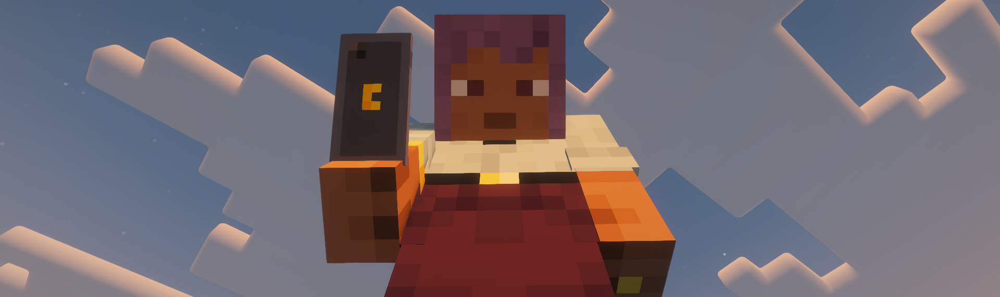
</p>

<details>
<summary><b>Home, sign-in &amp; registration</b></summary>
<br>

| Home screen | Registration | Login |
|:---:|:---:|:---:|
| 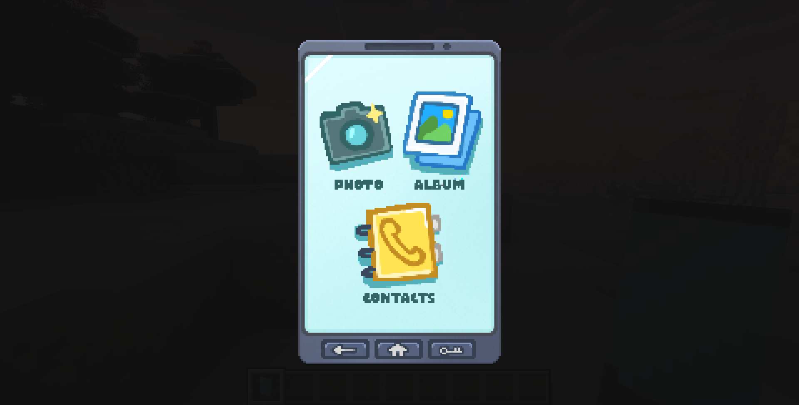 | 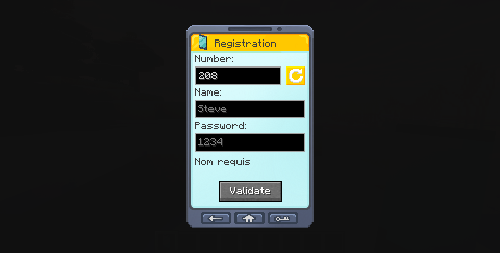 | 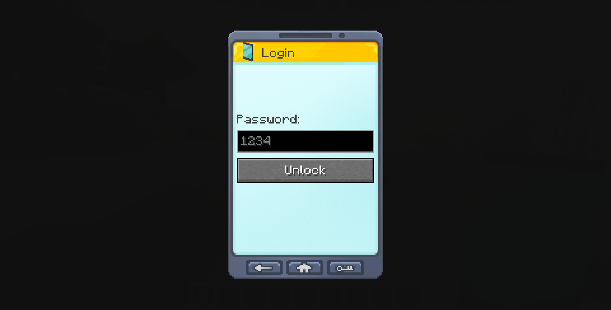 |

</details>

<details>
<summary><b>Messaging (contacts, favorites, groups &amp; conversations)</b></summary>
<br>

| Messaging | Adding a contact |
|:---:|:---:|
| 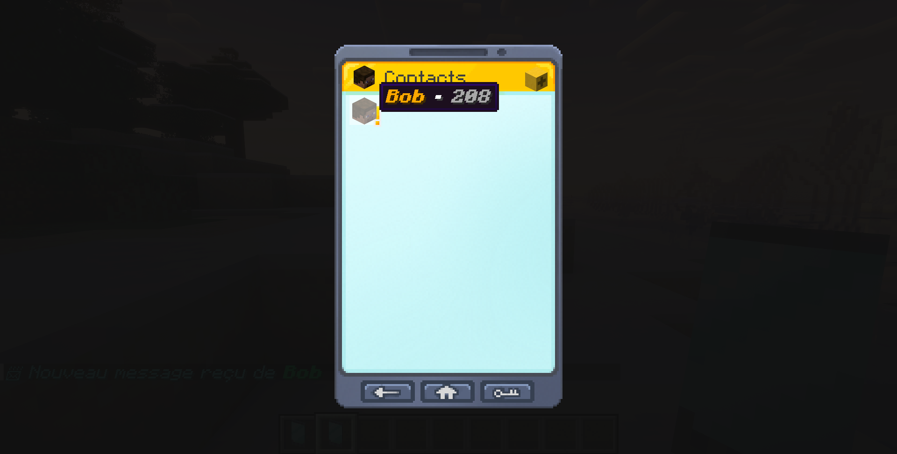 | 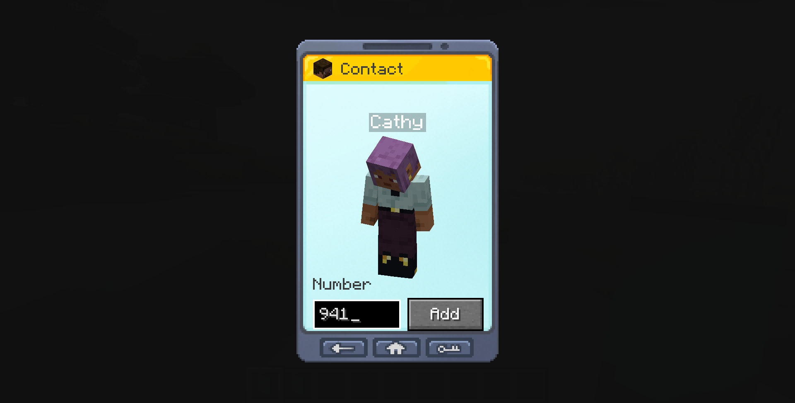 |

| Conversation | Sending an image |
|:---:|:---:|
| 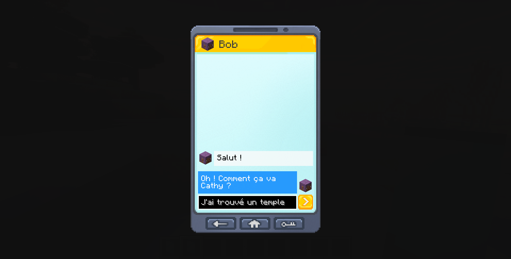 | 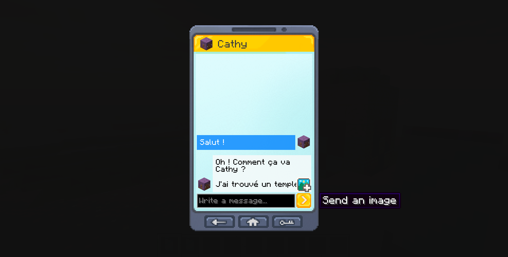 |
| An image sent in chat | Timestamp & zoom tooltip |
| 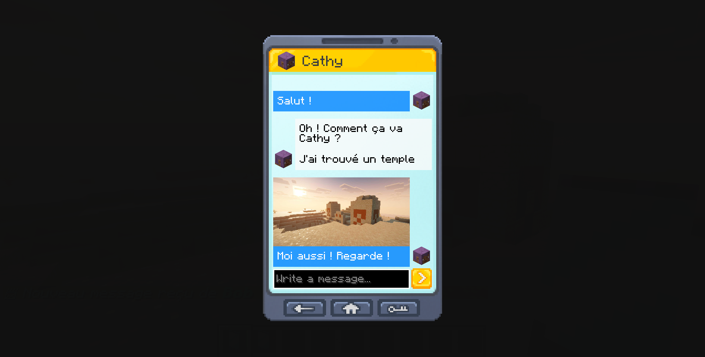 | 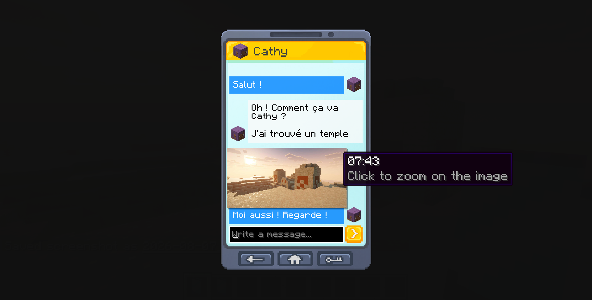 |

</details>

<details>
<summary><b>Camera (outdated screenshots)</b></summary>
<br>

> [!NOTE]
> These screenshots are from the old Camera-mod-backed album UI, since replaced by the native
> capture-overlay/photo-item flow described under [Features](#-features). Kept here as history until
> fresh screenshots of the new flow are taken.

| A photo taken with the phone's camera | Albums | Album contents | Picking images to send |
|:---:|:---:|:---:|:---:|
| 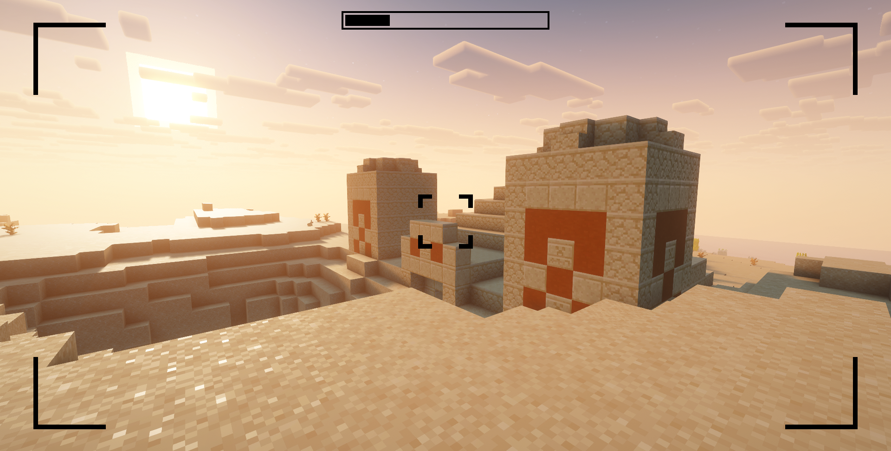 | 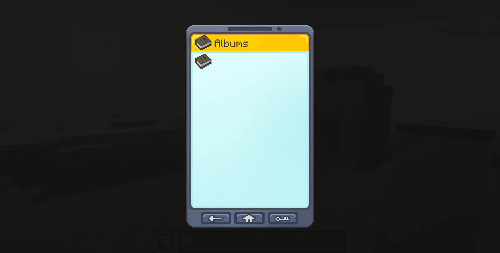 | 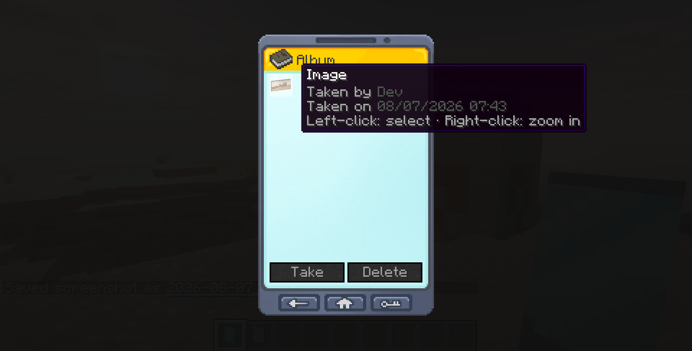 | 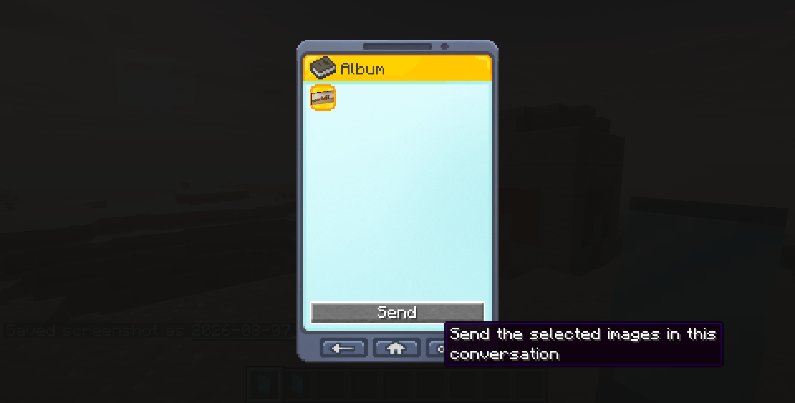 |

</details>

---

## 🌍 Localization

Every piece of UI text (button labels, tooltips, placeholders, headers) is routed through the lang files,
no hardcoded strings:

```
src/main/resources/assets/crazyphone/lang/en_us.json
src/main/resources/assets/crazyphone/lang/fr_fr.json
```

Want to add another language? Copy `en_us.json` to `<your_locale>.json` and translate the values; the
keys must stay identical between files.

---

## 🐛 Why this exists

The original `crazythings` implementation stored every phone, contact, and message ever sent, in every
conversation, forever, in one `SavedData` blob - and broadcast the *entire* thing to *every online player*
on every login and every message sent. History was never pruned, so the payload only grew across the
server's lifetime; that's what eventually crashed the server on player connect.

This rewrite splits that blob by purpose:

| Data | Storage | Sync behavior |
|---|---|---|
| Phone registry, contacts, mayor state | `PhoneRegistrySavedData` | Small by construction, still synced in full on login |
| Conversation messages (incl. voice audio, images) | `ConversationSavedData`, one bucket per conversation | **Never** broadcast; fetched on demand when a conversation is opened, capped and trimmed on write |

A new message now notifies only the participants who are online, instead of the whole server, so payload
size stays bounded no matter how long the world has run or how much history has accumulated. The same
principle carries through the voice features added later, and through Fabric's own photo pipeline: call
audio, voice message audio, and image bytes are only ever sent to the players who actually need them, on
demand, never broadcast.

The original `crazythings` camera feature also depended on a third-party mod (Camera) for capture, storage,
and rendering. That dependency is gone: capture (zoom, framing, shutter), dual-resolution storage, the
custom photo item and its own per-instance renderer, and sneak-presenting are all original code here, wired
into each loader's own item-rendering entry point (`IClientItemExtensions` on NeoForge,
`BuiltinItemRendererRegistry` on Fabric) rather than through a shared external renderer. Some of the
trickiest bugs in this rewrite lived exactly at that seam - a NeoForge SDK quirk on 1.20.4 where the
platform never calls the standard renderer hook at all (worked around with a direct `ItemRenderer` mixin),
and per-version differences in how much of the camera/hand transform chain is already baked into the
pose stack by the time a custom renderer runs.

---

## 📁 Project structure

Stonecutter splits the codebase into a shared source tree and one subproject per target version/loader:

```
CrazyPhone/
├── src/main/java/fr/lordfinn/crazyphone/   Shared source tree - every target compiles from here
│   ├── client/gui/       Screens (one per phone page) + shared widgets
│   ├── client/picture/   Native screenshot capture + texture cache, shared by both loaders
│   ├── command/          /crazyphone command tree
│   ├── data/             SavedData + player attachments (the crash fix lives here)
│   ├── enchantment/       Soulbound enchantment (≥1.20.5 only)
│   ├── fabric/            Fabric entrypoints + per-loader registration glue
│   ├── init/              Item/menu/screen/tab/sound/permission registration
│   ├── item/              The Crazy Phone item and photo item, vanilla item models & inventory capability
│   ├── mixin/             A single vanilla cursor-recentering fix (NeoForge only)
│   ├── network/           Client-server packets
│   ├── procedures/        Gameplay logic (ported from the original mod, adapted to the new data layer)
│   ├── utils/              Shared helpers (contacts, screen navigation, NBT/registry compat)
│   ├── voicechat/         Optional Simple Voice Chat integration (NeoForge only)
│   └── world/inventory/   Container menus backing each screen
├── versions/                One Stonecutter subproject per build target (1.20.4, 1.21.1, 1.21.10,
│                            1.20.1-fabric, 1.21.1-fabric) - each has its own gradle.properties pinning
│                            that target's Minecraft/loader/dependency versions
├── build.gradle.kts          Default build script - NeoForge targets
├── build.fabric.gradle.kts    Build script used by the two "-fabric" subprojects (Fabric Loom)
└── stonecutter.gradle.kts     Wires up the //? if fabric / //? if neoforge / //? if >=X.Y preprocessor
```

Per-loader and per-version differences in the shared tree are handled with Stonecutter comment
directives (e.g. `//? if fabric { ... }`, `//? if >=1.20.5 { ... }`) rather than separate source sets or
an abstraction layer - most files are identical on every target; only the files that genuinely differ
(registries, networking, attachments, a handful of NeoForge/Fabric API divergences) carry any gating.

---

## 🙏 Credits

- **[Simple Voice Chat](https://modrepo.de/minecraft/voicechat)** by [henkelmax](https://github.com/henkelmax): the voice engine calls and voice messages are built on top of (NeoForge only).
- **[Pixel Twemoji 9x](https://modrinth.com/resourcepack/pixel-twemoji-9x)** by [AmberW](https://modrinth.com/user/AmberW), based on [Twemoji](https://github.com/twitter/twemoji) (Copyright (c) 2018 Twitter, Inc and other contributors): pixel-art emoji glyphs bundled into the chat font. Both CC-BY-4.0 - see [`THIRD-PARTY-LICENSES.md`](THIRD-PARTY-LICENSES.md).
- Original `crazythings` project (also mine): source of the feature set and assets this mod ports and rebuilds.

## 📄 License

`All Rights Reserved`. See the mod description in [`gradle.properties`](gradle.properties) for authorship details.
